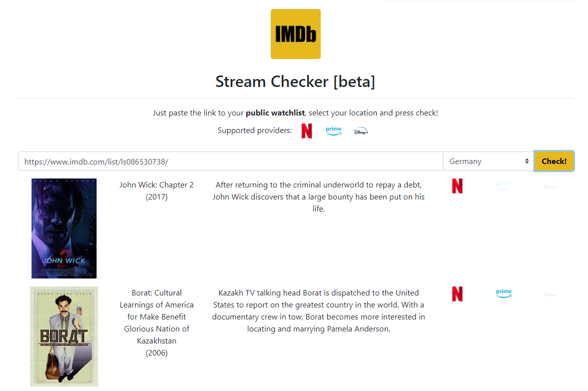
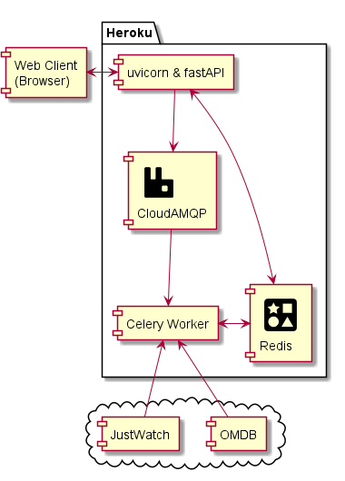

# IMDb Stream Checker


Given an IMDB list check availability on Netflix, Amazon Prime & Co.

~~Try it out: [https://imdb-checker.herokuapp.com/](https://imdb-checker.herokuapp.com/)~~ 

Feel free to host it on your own Heroku instance, see [here](#heroku).




## Architecture



A web-client (browser) sends an IMDb url to the server which returns the availability result after it is processed.

In order to decouple time consuming processing we use [Celery](https://docs.celeryproject.org/en/stable/). 
A worker picks up a task from the AMQP broker and pushes the result to the result store (Redis).

In the mean time, the frontend polls the server, whether the result is ready. 
In case of `SUCCESS` state, client can query `/get_state` to retrieve the results.

The logic (which runs in Celery worker) queries [JustWatch](https://www.justwatch.com/) API for availability information and [OMDb](http://www.omdbapi.com/) for media description and posters.

## Required resources

### Heroku

See [Procfile](Procfile) for running the server on a free Heroku instance. Also refer to Heroku [docs](https://devcenter.heroku.com/articles/procfile#deploying-to-heroku) regarding more details on deployment. Note, that you have to set some environment variables, see parameters in [logic/config.py](logic/config.py).

### RabbitMQ

Celery requires a broker queue to collect the requested IMDB urls and process them. 
The address to this queue is set via `CELERY_BROKER_URL` environment variable.

If not set, Celery will use `amqp://localhost`.

### Redis

In order to store processed results Celery requires a result store. The address to the result store is set via `CELERY_RESULT_URL` environment variable.

If `CELERY_RESULT_URL` is not set (for local development) a `sqlite` database is used.

### OMDb

For retrieving media information and posters OMDb API-key `OMDB_API_KEY` has to be set.

## Development

First install the requirements:

```
pip install -r requirements.txt
choco install rabbitmq
```

Set environment variables (if not set):

```
source .env OR call .env.bat
```

Start celery worker (with `--pool=solo` on Windows):

```
celery -A celery_tasks worker --loglevel=INFO --pool=solo
```

Start server in a new terminal:

```
uvicorn app:app --reload
```

## Unittests

In order to run unittests for app's logic:

```
pytest .\tests\
```